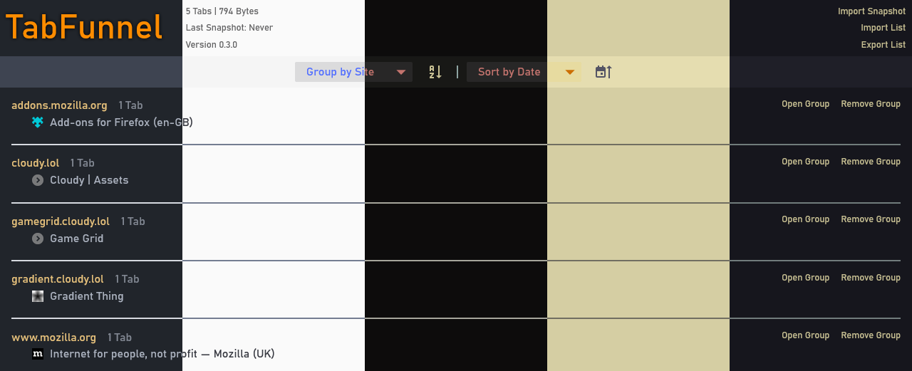

# TabFunnel

Tab Funnel is a browser addon to collect tabs into a single list that can be grouped and sorted.

## Features
- Funnel Tabs from tab bar
- List funnelled tabs in Dashboard
- Group and Sort tabs in Dashboard
- Context Menu Options
- Theming Support
- Search via Omnibox
- Backups (Snapshots)
- Snapshots Triggered Automatically (when data changes)
- Regular Snapshots (Daily, Weekly, Monthly)
- Import / Export
- Automatic Syncing (Firefox)

## What isn't a Feature
- Custom Grouping / Sorting
- Editing Tabs / Data
- Mobile Version
